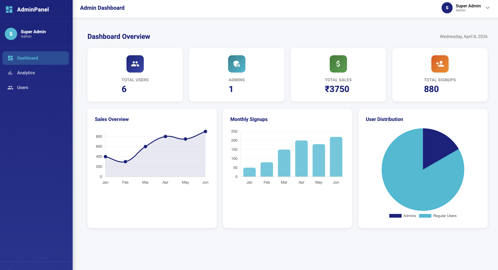

# Admin Dashboard with Analytics & Reporting

A full-stack MEAN (MongoDB, Express.js, Angular, Node.js) admin dashboard with real-time analytics, user management, and role-based access control.

---
## Demo Video

🎥 Watch the project demo here: [Admin Dashboard Demo](https://drive.google.com/file/d/1sbd66QcLatkKAQPzxQeZW9g4FB_y-_mq/view?usp=drive_link)

## Screenshots

### Login Page

> Secure login page with JWT authentication. Includes demo credentials for quick access.

### Dashboard

> Main dashboard showing real-time summary cards — Total Users, Admins, Total Sales and Signups — with Sales Overview (line chart), Monthly Signups (bar chart) and User Distribution (pie chart).

### User Dashboard (Regular User View)

> Dashboard view for a regular user — Users menu is hidden, only Dashboard and Analytics are accessible based on role.

### User Management

> Admin-only page to manage all users. Supports adding, editing, deleting users with role assignment and live search.

### Analytics — Sales Trends

> Detailed sales trend line chart showing monthly revenue data across the year.

### Analytics — Signup Trends

> Bar chart showing monthly new user signups to track growth over time.

### Analytics — Active Users

> Line chart tracking monthly active users to monitor platform engagement.
---

## Tech Stack

| Layer      | Technology         | Version  |
|------------|--------------------|----------|
| Frontend   | Angular            | 21.x     |
| UI Library | Angular Material   | 21.x     |
| Charts     | Chart.js + ng2-charts | 6.x   |
| Backend    | Node.js            | 24.x     |
| Framework  | Express.js         | 4.x      |
| Database   | MongoDB (Atlas)    | 7.x      |
| ODM        | Mongoose           | 8.x      |
| Auth       | JWT + bcryptjs     | —        |
| Package Manager | npm           | 11.x     |

---

## Features

- Secure JWT-based authentication with bcrypt password hashing
- Role-based access control (Admin / User)
- Admin dashboard with real-time charts (Sales, Signups, Active Users)
- User management — Create, Read, Update, Delete users
- Analytics page with detailed data visualizations
- Responsive design — works on mobile and desktop
- Protected routes with Angular route guards
- Skeleton loading screens for better UX
- Seed script to populate demo data instantly

---

## Project Structure
admin-dashboard/
├── server/                         # Node.js + Express backend
│   ├── models/
│   │   ├── User.js                # User schema with roles and authentication data
│   │   └── Metric.js              # Stores analytics and chart data
│   │
│   ├── routes/
│   │   ├── auth.js                # Login and authentication routes
│   │   ├── dashboard.js           # Dashboard analytics endpoints
│   │   └── users.js               # User management endpoints
│   │
│   ├── middleware/
│   │   ├── auth.js                # JWT authentication middleware
│   │   └── admin.js               # Admin role authorization middleware
│   │
│   ├── server.js                  # Main Express server entry point
│   ├── seed.js                    # Script to populate demo data
│   └── .env                       # Environment variables
│
└── admin-frontend/                # Angular frontend
    └── src/
        └── app/
            ├── core/
            │   ├── auth.service.ts    # Handles login, logout, token storage
            │   ├── api.service.ts     # Centralized API calls
            │   └── auth.guard.ts      # Protects authenticated routes
            │
            ├── layout/
            │   ├── main-layout/       # Main application layout wrapper
            │   ├── sidebar/           # Sidebar navigation component
            │   └── navbar/            # Top navigation bar component
            │
            └── pages/
                ├── login/             # Login page
                ├── dashboard/         # Dashboard with charts and summary cards
                ├── users/             # User management page
                └── analytics/         # Analytics and reporting page

---

## Local Setup

### Prerequisites

Make sure you have these installed:

- Node.js v24.x — https://nodejs.org
- npm v11.x — comes with Node.js
- Angular CLI v21.x — `npm install -g @angular/cli`
- MongoDB Atlas account — https://cloud.mongodb.com (free tier)

---

### 1. Clone the Repository

```bash
git clone https://github.com/your-username/admin-dashboard.git
cd admin-dashboard
```

---

### 2. Backend Setup

```bash
cd server
npm install
```

Create a `.env` file in the `server/` folder:

```env
MONGO_URI=your_mongodb_atlas_connection_string
JWT_SECRET=your_secret_key_here
PORT=5050
```

Seed the database with demo data:

```bash
node seed.js
```

Start the backend server:

```bash
node server.js
```

Backend runs at: `http://localhost:5050`

---

### 3. Frontend Setup

Open a new terminal:

```bash
cd admin-frontend
npm install
ng serve
```

Frontend runs at: `http://localhost:4200`

---

## Demo Credentials

| Role  | Email              | Password  |
|-------|--------------------|-----------|
| Admin | admin@demo.com     | admin123  |
| User  | john@demo.com      | user123   |

---

## API Endpoints

| Method | Endpoint                | Auth     | Description              |
|--------|-------------------------|----------|--------------------------|
| POST   | /api/auth/register      | Public   | Register new user        |
| POST   | /api/auth/login         | Public   | Login and get JWT token  |
| GET    | /api/dashboard/stats    | Token    | Get dashboard metrics    |
| GET    | /api/users              | Admin    | Get all users            |
| POST   | /api/users              | Admin    | Create new user          |
| PUT    | /api/users/:id          | Admin    | Update user              |
| DELETE | /api/users/:id          | Admin    | Delete user              |

---

## Role-Based Access

| Feature              | Admin | User |
|----------------------|-------|------|
| View Dashboard       | ✅    | ✅   |
| View Analytics       | ✅    | ✅   |
| View Users Page      | ✅    | ❌   |
| Add / Edit Users     | ✅    | ❌   |
| Delete Users         | ✅    | ❌   |

---

## Running Both Servers

You need two terminals running simultaneously:

**Terminal 1 — Backend:**
```bash
cd server && node server.js
```

**Terminal 2 — Frontend:**
```bash
cd admin-frontend && ng serve
```

Then open `http://localhost:4200` in your browser.

